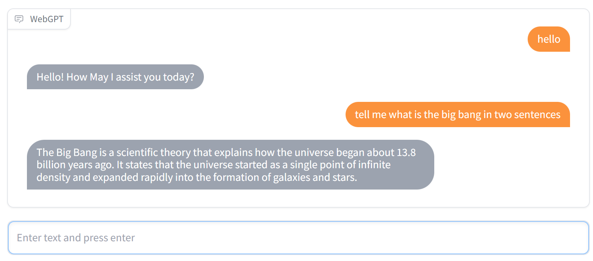

## Description

This app is a Chatbot UI that uses the OpenAI ChatGPT API to provide responses to text inputs.
It is launched using the Gradio library, which allows the user to enter text queries from a nice interface and receive responses from the chatbot.



## Install Dependencies

Run:

```bash
pip install -r requirements.txt
```

## API Key

The app will need an OpenAI API Key to work.
To specify it, create a .env file and write your OpenAI API key

```bash
OPENAI_API_KEY=XXXXXXXXX
```

## Start App

Just run:

```bash
python -m venv env
source env/Scripts/
pip install -r requirements.txt

gradio mywebgpt.py
python pandasaichatbot.py
gradio pandasaichatbot.py

pip freeze > modules.txt
pip uninstall -r modules.txt -y
```

Then, you can see your app at the url `http://127.0.0.1:8080/`.

## Matplotlib画图

<https://zhuanlan.zhihu.com/p/109245779>
<https://github.com/aimerou/gradio-chatgpt-app/tree/main>
